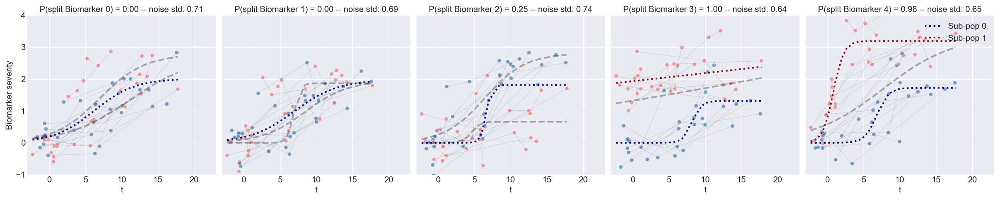

<div align="center">
  Data
</div>



# DP-MoSt: Disease Progression Modeling and Sub-Trajectory Identification

DP-MoSt is a method designed to model disease progression and identify sub-populations within a cohort based on longitudinal biomarker data. It optimizes two complementary problems: 

1. **Estimating an absolute long-term disease time axis from short-term observations**.
2. **Identifying sub-populations along this disease time axis with respective sub-trajectories**.

## Overview

### Problem (i): Estimating Disease Time Axis

For each individual $j$, we define the observations across all biomarkers as $\mathbf{x}^j = (\mathbf{x}^j_1, ..., \mathbf{x}^j_B)$, where 

$$
\mathbf{x}^j_b = (x_b^j(\hat t_{1}), ..., x_b^j(\hat{t}_{k_j})).
$$ 

Morevoer, we define $B$ is the number of biomarkers, and assuming common sampling times among all subjects and biomarkers, we parameterize the individual time axis via a translation by a time-shift $\delta ($ $\hat t_j$ $)$.

We evaluate the time shifts using the Gaussian process theory of GPPM, which describes biomarker trajectories from normal to pathological stages monotonically.

### Problem (ii): Identifying Sub-Populations

Given the observations $\mathbf{x} = \mathbf{x^{1:J}}$, where $J$ is the number of subjects, and the estimated absolute time $\mathbf{t} = \mathbf{t}_{1:J}$, we define a trajectory mixture model to identify sub-populations. 

We assume that the evolution of each biomarker $b$ can be split into multiple sub-trajectories with probability $\xi_b$ ($b=1, \ldots, B$). Each subject $j$ is assumed to be issued from a sub-trajectory with probability $\pi_j$ ($j=1, \ldots, J$). Both $\xi$ and $\pi$ are assumed to be time-independent, ensuring consistent sub-trajectory assignment across all biomarkers.

### Model Assumptions

- **Disease Trajectories**: Modeled as increasing sigmoidal functions.
- **Measurement Noise**: Modeled as additive Gaussian noise with standard deviation $\sigma = (\sigma_b)_{b=1}^B$.

### Posterior Distribution

The posterior distribution for the model is given by:

$$
p(\theta, \sigma, \xi, \pi \mid \mathbf{x}) \propto p(\theta, \sigma, \xi, \pi) \prod_{j,b} p(\mathbf{x_b^j} \mid \theta_b, \sigma_b, \xi_b, \pi_j)
$$

where $\theta$ are the parameters of the sigmoidal functions.

### Likelihood Function

The likelihood function can be expanded to highlight the two-level mixture model formulation:

$$
p(\mathbf{x} \mid \theta, \sigma, \xi, \pi) = \prod_{j,b} \left[ p(\mathbf{x_b^j} \mid \theta_b^0, \sigma_b)\xi_b + \left(\pi_j p(\mathbf{x_b^j} \mid \theta_b^1, \sigma_b) + (1-\pi_j) p(\mathbf{x_b^j} \mid \theta_b^2, \sigma_b) \right)(1-\xi_b) \right]
$$

where

- %20=%20\prod_{\ell=1}^{k_j}%20\text{NormPDF}(x_b^j(t_\ell),%20f(t_\ell%20\mid%20\theta_b^i),%20\sigma_b))
- $f(t_\ell \mid \theta_b^i)$ is a Sigmoid function with parameters $\theta_b^i$.

<div align="center">
  Solution
</div>


## Installation

To install and use DP-MoSt, follow these steps:

```bash
# Clone the repository
git clone https://github.com/alessandro-viani/dp-most.git

# Navigate to the repository directory
cd dp-most

# Install the required dependencies
pip install matplotlib==3.8.3
pip install pandas==1.5.3
pip install numpy==1.26.4
pip install scikit-learn==1.4.1.post1
pip install scipy==1.12.0
pip install seaborn==0.13.2
pip install torch==2.2.1

```

## Usage

An example jupyter notebook is availabel in the repository to demonstrate a typical workflow.

## Contributing

We welcome contributions to DP-MoSt! If you find a bug or have a feature request, please open an issue. To contribute code, please fork the repository, create a new branch, and submit a pull request.

## References

Viani, Lorenzi, et al. (2024). Disease Progression Modelling and Stratification for detecting sub-trajectories in the natural history of pathologies: application to Parkinson's Disease trajectory modelling.

## Contact

For questions or support, please contact [alessandro.viani@inria.fr].

---
```

This README includes properly formatted LaTeX equations using `$` for inline and block mathematical expressions.
